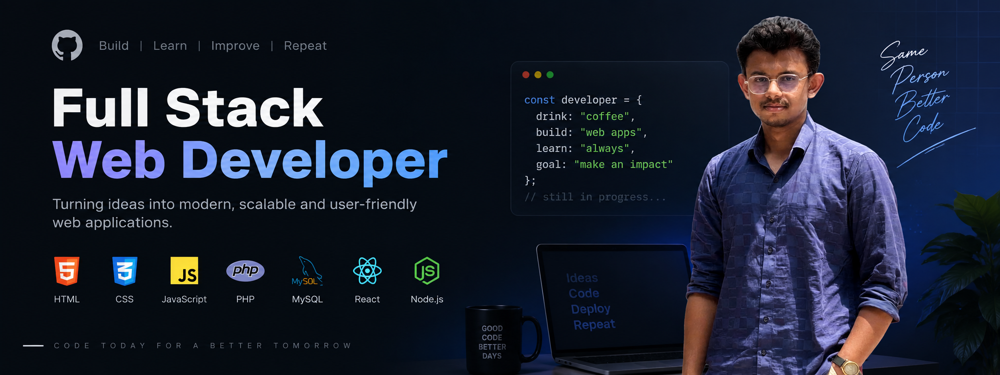

<!-- ===================== BANNER ===================== -->

<p align="center">
  
</p>

<!-- ===================== INTRO ===================== -->

<h1 align="center">Hi 👋, I'm Sadman</h1>

<h3 align="center">
  A passionate Full-Stack Developer in the making from Bangladesh 🇧🇩
</h3>

<p align="center">
  <a href="https://github.com/SadmanBhuiyan">
    
  </a>
</p>

<p align="center">
  <a href="https://github.com/SadmanBhuiyan">
    
  </a>

  <a href="https://github.com/SadmanBhuiyan?tab=repositories">
    
  </a>
</p>

---

<!-- ===================== ABOUT ME ===================== -->

## 👨‍💻 About Me

I'm a passionate developer focused on building modern, responsive, and scalable web applications.

- 🌱 Currently learning **Full-Stack Web Development**
- ⚛️ Exploring **React & Next.js**
- 📘 Strengthening my **JavaScript & TypeScript** fundamentals
- 🎨 Building responsive interfaces with **HTML, CSS & Tailwind CSS**
- 🧠 Practicing problem solving and programming fundamentals
- 🔧 Learning how modern web applications work from frontend to backend
- 🚀 Goal: Become a professional **Full-Stack Developer**
- 🇧🇩 Based in **Bangladesh**

> 💡 Currently focused on learning, building projects, and improving every day.

---

<!-- ===================== TECHNOLOGIES ===================== -->

## 🛠️ Languages & Technologies

### 💻 Programming Languages

<p align="left">
  <a href="https://developer.mozilla.org/en-US/docs/Web/JavaScript">
    
  </a>

  <a href="https://www.typescriptlang.org/">
    
  </a>

  <a href="https://www.python.org/">
    
  </a>

  <a href="https://www.php.net/">
    
  </a>
</p>

### 🌐 Frontend

<p align="left">
  <a href="https://www.w3.org/html/">
    
  </a>

  <a href="https://www.w3schools.com/css/">
    
  </a>

  <a href="https://react.dev/">
    
  </a>

  <a href="https://nextjs.org/">
    
  </a>

  <a href="https://tailwindcss.com/">
    
  </a>
</p>

### 🗄️ Backend & Database

<p align="left">
  <a href="https://www.mysql.com/">
    
  </a>
</p>

### 🔧 Tools

<p align="left">
  <a href="https://git-scm.com/">
    
  </a>

  <a href="https://github.com/">
    
  </a>
</p>

---

<!-- ===================== CURRENTLY WORKING ON ===================== -->

## 🚀 What I'm Currently Working On

```text
Frontend Development    ███████████████████░░   90%
JavaScript              ██████████████████░░░   85%
TypeScript              ████████████████░░░░░   75%
React                   ███████████████░░░░░░   70%
Next.js                 █████████████░░░░░░░░   65%
Backend Development     ██████████░░░░░░░░░░   50%
Databases               █████████░░░░░░░░░░░   45%
```

> These percentages represent my current learning focus rather than professional experience.

---

<!-- ===================== FEATURED PROJECTS ===================== -->

## 🚀 Featured Projects

<p align="center">

  <a href="https://github.com/SadmanBhuiyan/A-5-Dev-Stack">
    
  </a>

  <a href="https://github.com/SadmanBhuiyan/Frame_It">
    
  </a>

</p>

---

<!-- ===================== GITHUB STATISTICS ===================== -->

## 📊 GitHub Statistics

<p align="center">
  
</p>

<p align="center">
  
</p>

<p align="center">
  
</p>

---

<!-- ===================== CONTRIBUTION SNAKE ===================== -->

## 🐍 Contribution Snake

<p align="center">
  <picture>
    <source
      media="(prefers-color-scheme: dark)"
      srcset="https://raw.githubusercontent.com/SadmanBhuiyan/SadmanBhuiyan/output/github-contribution-grid-snake-dark.svg"
    />
    <source
      media="(prefers-color-scheme: light)"
      srcset="https://raw.githubusercontent.com/SadmanBhuiyan/SadmanBhuiyan/output/github-contribution-grid-snake.svg"
    />
    
  </picture>
</p>


<!-- ===================== CONNECT ===================== -->

## 🤝 Connect With Me

<p align="center">

  <a href="https://www.linkedin.com/in/md-sadman-amin-bhuiyan-suny">
    
  </a>

  <a href="https://github.com/SadmanBhuiyan">
    
  </a>

</p>

---

<!-- ===================== FOOTER ===================== -->

<h3 align="center">
  ✨ Learning • Building • Improving ✨
</h3>

<p align="center">
  Thanks for visiting my profile! ⭐
</p>
